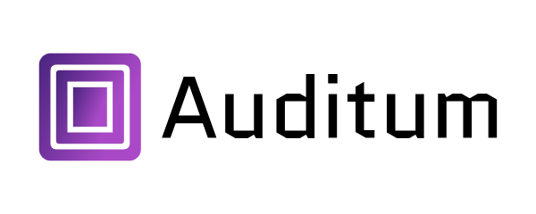

  

  <em>Audit Log management system for any application.</em>

  <i>Cloud Native • Developer-friendly • Open Source</i>

  
  

---

# Auditum

Auditum is an audit trail management software. It allows you to collect, store,
and query audit records (also known as audit logs) for multiple applications in
one place and query them using a simple API. It is designed to integrate well 
with business applications, and it can be used with any software that produces
audit logs.

Features:

- **Cloud Native** – built to deploy anywhere
- **Developer-friendly** – easy to configure, use and hack on
- **Flexible** - designed to fit your data
- **API-first** - with support for HTTP and gRPC protocols
- **Observability** – built-in logging, metrics and tracing
- and more...

## Documentation

The documentation is available at [auditum.io](https://auditum.io/).

## Contributing

We welcome and appreciate contributions!

We kindly ask to raise an issue before submitting a pull request, especially for
new features. This will help us to discuss the feature and agree on implementation details.

## License

This project is licensed under the terms of the [Apache License 2.0](LICENSE).
